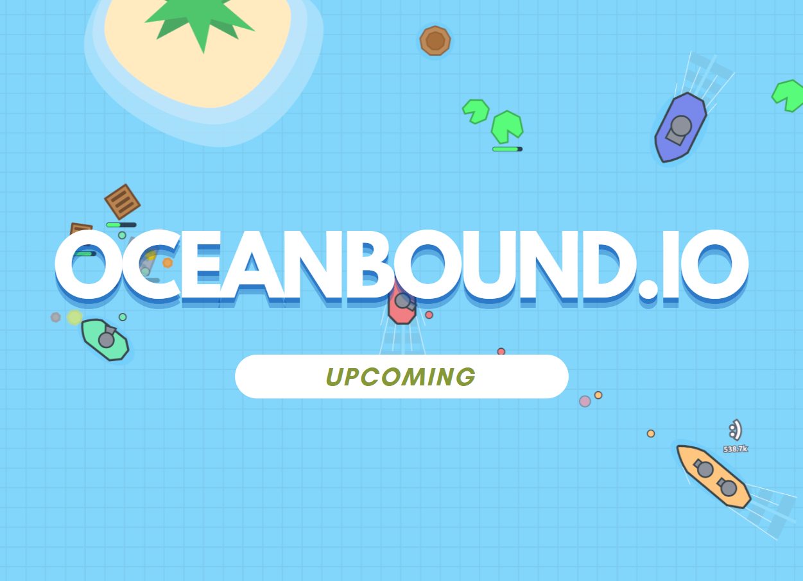

# Oceanbound.io  

Welcome to the official **Oceanbound.io** repository! 🌊  

  

## About  
This repository will host the source code for the **first playable version** of Oceanbound.io. Once it's published, you'll be able to contribute, report issues, and help shape the game’s development.  

## Cross-Platform Support  
Oceanbound.io is designed to run on multiple platforms, including:  
- **Web** (via Emscripten)  
- **Android**  
- **Desktop** (Windows, Linux)  

## Technologies Used  
- **C** (Core game logic for both client and server)
- **SDL3** (Rendering, input handling)  
- **Emscripten** (Web compatibility)  
- **WebSockets** (Network communication)
- **Node.js** (Load balancing and server management)
- **HTML & CSS** (Web interface)

## Contributing  
Once the source code is available, you’ll be able to:  
- Submit bug reports & feature requests  
- Contribute code improvements & new features  
- Discuss ideas and optimizations  

## Join the Community
Want to chat, share ideas, or get updates? Join our **[Discord](https://discord.gg/Rs3yyHJtmn)**. community

## License
This project is licensed under the [GNU AGPL-3.0](LICENSE).
